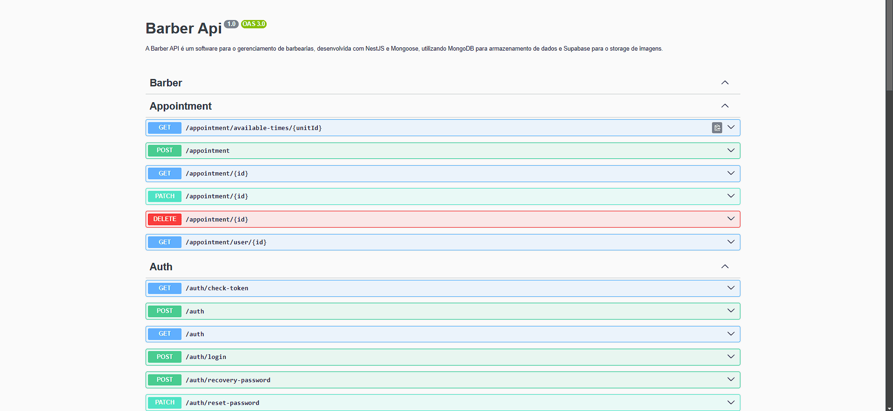
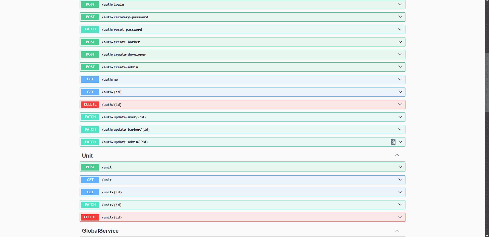
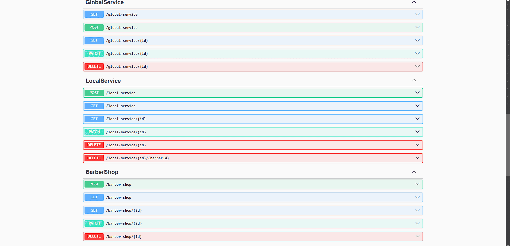
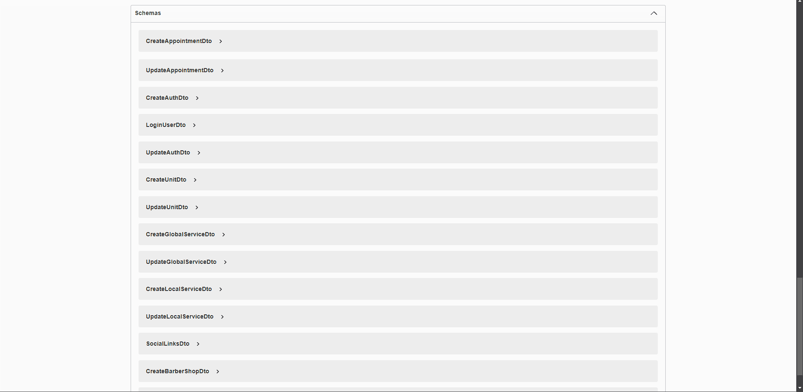

# ✂️ Barber - API

A Barber API é um software para o gerenciamento de barbearias, desenvolvida com NestJS e Mongoose, utilizando MongoDB para armazenamento de dados e Supabase para o storage de imagens.

## 🚀 Funcionalidades Principais:

- ✅ Autenticação e recuperação de usuários  
- ✅ Gerenciamento de agendamentos para horários de atendimento  
- ✅ Cadastro de serviços globais e locais  
- ✅ Criação e administração de unidades da barbearia  
- ✅ Gestão de barbeiros e funcionários  
- ✅ Configuração de horários de funcionamento  
- ✅ Gerenciamento de contatos e redes sociais  

## 🛠️ Tecnologias Utilizadas

📌 **Back-end**

- [NestJS](https://docs.nestjs.com/) - Framework progressivo para Node.js
- [Node.js](https://nodejs.org/en) Ambiente de execução JavaScript
- [Typescript](https://www.typescriptlang.org/) Superconjunto tipado do JavaScript
- [Express](https://expressjs.com/pt-br/) Framework web minimalista para Node.js

📚 **Bibliotecas**

- [swagger](https://www.npmjs.com/package/swagger) Documentação de API
- [mongoose](https://www.npmjs.com/package/mongoose) ODM para MongoDB
- [class-transformer](https://www.npmjs.com/package/class-transformer) Manipulação de objetos em TypeScript
- [class-validator](https://www.npmjs.com/package/class-validator) Validação de dados
- [@supabase/supabase-js](https://www.npmjs.com/package/@supabase/supabase-js) Integração com Supabase
- [bcrypt](https://www.npmjs.com/package/bcrypt) Hash de senhas seguras
- [date-fns](https://www.npmjs.com/package/date-fns) Manipulação de datas

## 📁 Swagger

 

 

🔋 **Controle de versão e deploy**

- [Git](https://git-scm.com) - Sistema de controle de versão

⚙️ **Configuranções e Instalações**

Clone do Projeto

    $ git clone https://github.com/Faelkk/fincheck-api

Instalando as dependências

    $ npm install

Iniciando o projeto

    $ npm run dev

 

**Como me ajudar nesse projeto?**

- Você ira me ajudar muito me seguindo aqui no GitHub
- Dando uma estrela no projeto
- Conectando-se comigo no LinkedIn para fazer parte da minha rede.

 

**Feito por**
[Rafael Achtenberg](linkedin.com/in/rafael-achtenberg-7a4b12284/)
